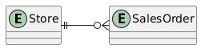
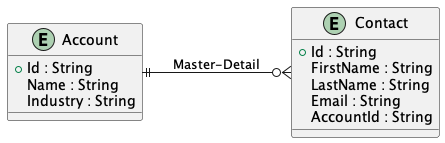
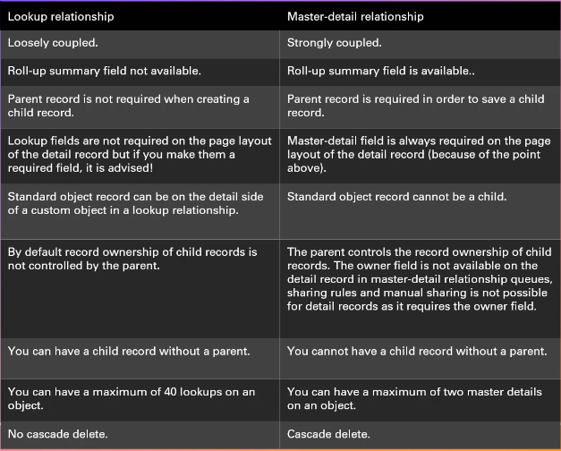
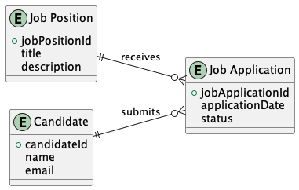
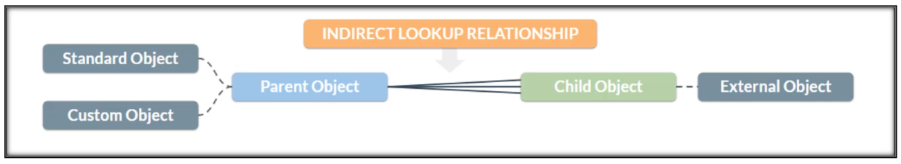
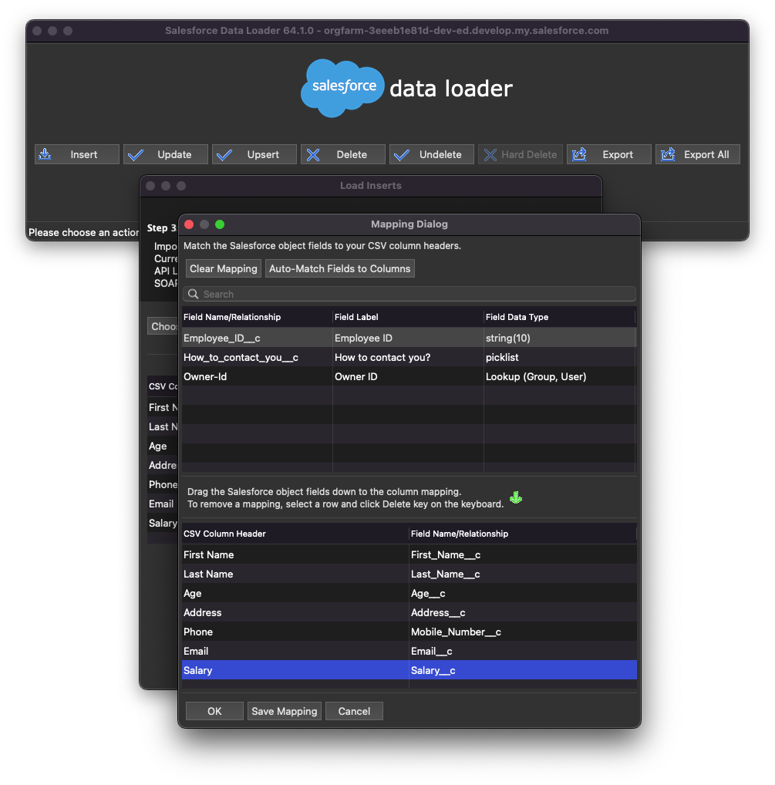
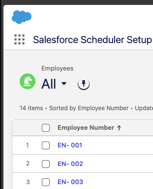
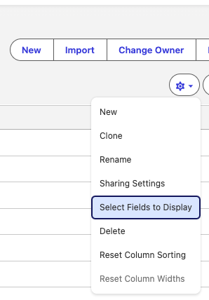
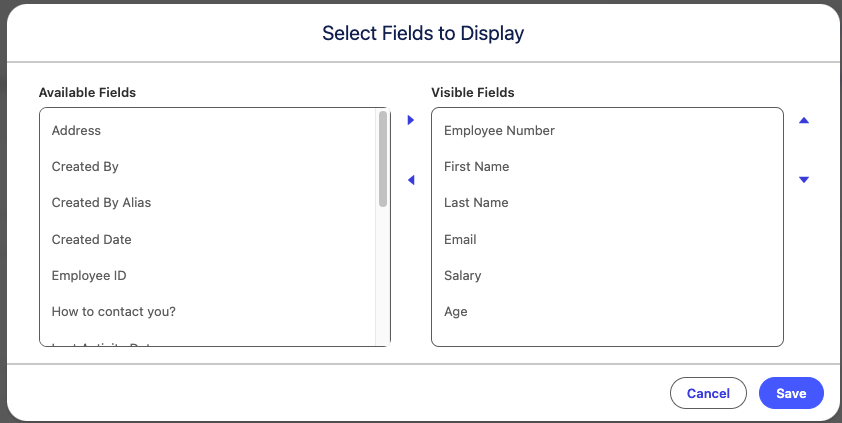
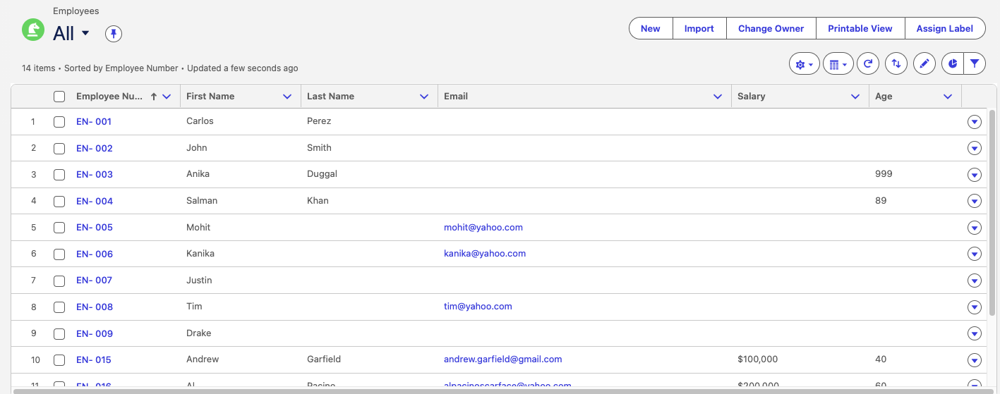

# Table of content
- [Table of content](#table-of-content)
- [SalesForce Dev](#salesforce-dev)
  - [Core](#core)
  - [Schema Builder](#schema-builder)
  - [Types of Relationship](#types-of-relationship)
    - [Lookup relationship](#lookup-relationship)
    - [Master-Detail relationship](#master-detail-relationship)
    - [Lookup vs Master-Detail relationship](#lookup-vs-master-detail-relationship)
    - [Many to many](#many-to-many)
      - [Junction Object](#junction-object)
  - [External Object](#external-object)
    - [External Lookup](#external-lookup)
    - [Indirect Lookup](#indirect-lookup)
  - [External Ids](#external-ids)
    - [Limitations and capabilities](#limitations-and-capabilities)
  - [Validation rules](#validation-rules)
    - [Restrict data input using validation rules:](#restrict-data-input-using-validation-rules)
    - [isPickVal](#ispickval)
    - [Valid format](#valid-format)
  - [Importing and Exporting Data](#importing-and-exporting-data)
    - [View CSV files by console](#view-csv-files-by-console)
    - [Data Import Options](#data-import-options)
    - [Download Data Loader](#download-data-loader)
    - [Import Records using Data Loader](#import-records-using-data-loader)
    - [Update Records using Data Loader](#update-records-using-data-loader)

# SalesForce Dev

## Core
* `Employe__c`: "`__c`" = Custom Object

## Schema Builder
* *View Options / Display Element Labels* para que en Custom Objects aparezca `Employee__c`. Si hago clic nuevamente en *Display Element Labels* mostrará de nuevo a la entidad como `Employee`

**Tips de Buenas Prácticas – Integraciones Salesforce**

* **No uses el Record Id de Salesforce** como identificador externo.
* **Crea un ID de negocio** (campo propio) para integraciones.
* Marca ese campo como **External ID + Unique**.
* **Usa prefijo** (ej. `EMP-000123`) para evitar ambigüedad entre sistemas.
* **No reutilices nunca** los identificadores.
* **Separa responsabilidades de campos**:

  * `Name` → UI / visual
  * `Employee_Number__c` → Integración
* Usa **Auto Number** si Salesforce es maestro; **Text** si el sistema externo manda el ID.
* El ID de integración debe ser **legible, estable y permanente**.

📌 **Formato recomendado**: `EMP-{000000}`

## Types of Relationship
* The relationship field will always go on the child object

### Lookup relationship
* A `Lookup relationship` is a loosely coupled relationship allowing you connect one object to another in a `one-to-many` fashion.



<!-- ```plantuml
@startuml
left to right direction

entity Store
entity SalesOrder

Store ||--o{ SalesOrder
@enduml
``` -->

### Master-Detail relationship
* A master detail relationship is a strongly coupled relationship, meaning if the parent is deleted so are the child records.
* Master-detail also allows the parent record to control child record attributes such as sharing and visibility. Whichever security setting you chose for the parent record; the child record inherits.



### Lookup vs Master-Detail relationship


### Many to many
* Many-to-many relationships allow two objects to be related to each other when a record from one object can be linked to multiple records from another object and vice versa.
* Two master-detail relationships can be used to create a many-to-many relationship between two objects. A many-to- many relationship simply allows the master record to have multiple detail records and the detail records to have multiple master or parent records.



#### Junction Object
* The junction object `Job Application` will be responsible for establishing a many to many relationship.
* A junction object is an object which has to master detail relationships.

## External Object
* External objects are similar to custom objects, except that they map to data that's stored outside your Salesforce org.
* Each external object relies on an external data source definition to connect with the external system's data.
* Each external object definition maps to a data table on the external system. Each of the external object's fields maps to a table column on the external system.
* External objects enable your users and the Lightning Platform to search and interact with the external data.
* By accessing record data on demand, external objects always reflect the current state of the external data. You don't have to manage a copy of that data in Salesforce, so you're not wasting storage and resources keeping data in sync.
* External objects are best used when you have a large amount of data that you can't or don't want to store in your Salesforce organization, and you need to use only a small amount of data at any one time. 
* By accessing record data on demand, external objects always reflect the current state of the external data. You don't have to manage a copy of that data in Salesforce, so you're not wasting storage and resources keeping data in sync.
* External objects are best used when you have a large amount of data that you can't or don't want to store in your Salesforce organization, and you need to use only a small amount of data at any one time.

### External Lookup
* External Lookup allows linking a child standard, custom or external object with a parent external object.


### Indirect Lookup
* Indirect Lookup allows linking a child external object with a parent standard or custom object.



## External Ids

* External IDs are fields that contain a unique identifier from a system outside of Salesforce
* External IDs are often created with the 'Unique ID' setting enabled so that External ID values are unique to each record inside Salesforce.
* For example, the 'SAP Account Number' field can be added to the Account object and markedas an External ID. When data is imported or integrated into the Account object, records can be matched using the SAP Account Number field instead of the record ID.

### Limitations and capabilities

* LIMIT: There can be up to 25 External ID fields on an object.
* FIELD TYPE: The field type must be number, text or email.
* SEARCHABILITY: External IDs are searchable in Salesforce.
* INDEXING: External ID fields are indexed, so searching should perform quicker.

## Validation rules

* Validation rules verify that the data a user enters in a record meets the standards you specify before the user can save the record.
* A validation rule can contain a formula or expression that evaluates the data in one or more fields and returns a value of "True" or "False".
* Validation rules also include an error message to display to the user when the rule returns a value of "True" due to an invalid value.

### Restrict data input using validation rules:

* Rule name: `Age_between_1_and_100`
* Error condition formula:
```plaintext
Age__c <0 || Age__c >100
```
* Error message: `Age is not valid. Please enter valid age`

### isPickVal
* Add a new field on the employee object.
* How to contact you? Picklist value (Phone, email)
* If the user has selected phone, then make sure Phone number is n blank and if the user has selected email, then email should not be blank.

```plaintext
OR(
  (ISPICKVAL(field, specific picklist value) && ISBlank(Phone)), 
  (ISPICKVAL(field, specific picklist value) && ISBlank(Email))
)
```

* Rule name: `How_to_contact_you_validation`
* Error condition formula:
```plaintext
	OR(
AND( ISPICKVAL( How_to_contact_you__c , "Phone"), ISBLANK( Mobile_Number__c) ),
AND( ISPICKVAL( How_to_contact_you__c , "Email"), ISBLANK( Email__c ))
)
```
* Error message: `Please provide Phone OR Email address to proceed.`

### Valid format

* Phone Number has to be in a valid format. 
```regex 
NOT(REGEX(Phone, "\\D*?(\\d\\D*?){10}"))
```
* Age should be between 1 and 100 years.<br><br>

Sample:
* Rule name: `Phone_Number_Validation`
* Error condition formula:
```regex
NOT(REGEX( Mobile_Number__c , "\\D*?(\\d\\D*?){10}"))
```
* Error message: `Please provide Valid phone number.`

## Importing and Exporting Data
* There are two main options when considering how to import data into a development environment:
  * Data Import Wizard
  * Data Loader

* For exporting data out of a salesforce environment, you have following options:
  * Data Loader
  * Exporting data via reports

### View CSV files by console
  * Install [miller](https://miller.readthedocs.io/en/6.16.0/)
```bash
brew install miller
mlr --c2p cat EmployeeDataInsert.csv | less -S
```

### Data Import Options
* `Data Loader`: Data loader can be used to load large files that contain up to 5 million records.
* `Data Import Wizard`: The Data Import Wizard can be accessed in Setup to import up to 50,000 records.
* `Data Loader CLI`: Data Loader can be used through the command-Line Interface for repetitive and complex operations.

*Setup / Home / Data Input Wizard*

### Download Data Loader
* Integrations / Data Loader / Downloads
* `java -jar dataloader-64.1.0.jar` (Java 17)

### Import Records using Data Loader
*Steps*
* Insert / OAuth / Production
* https://login.salesforce.com/
* Use Custom Domain
* trailhead.salesforce.com
* Login until arrives this message in browser: `Authorization Successful!`

*Import CSV*
* Select Salesforce Object: Employee__c
* Import from (CSV file): select file
* Next (Initialization succeeded)
* Step 2b: (Optional) relate using lookup field / Next
* Step 3: Mapping / Create or Edit a Map

* Save Mapping: EmployeeMappingDataLoader / OK
* Step 4: Finish / Select Results Forlder / Finish

### Update Records using Data Loader
* Employees All
* Pin columns



* Select Fields to Display


