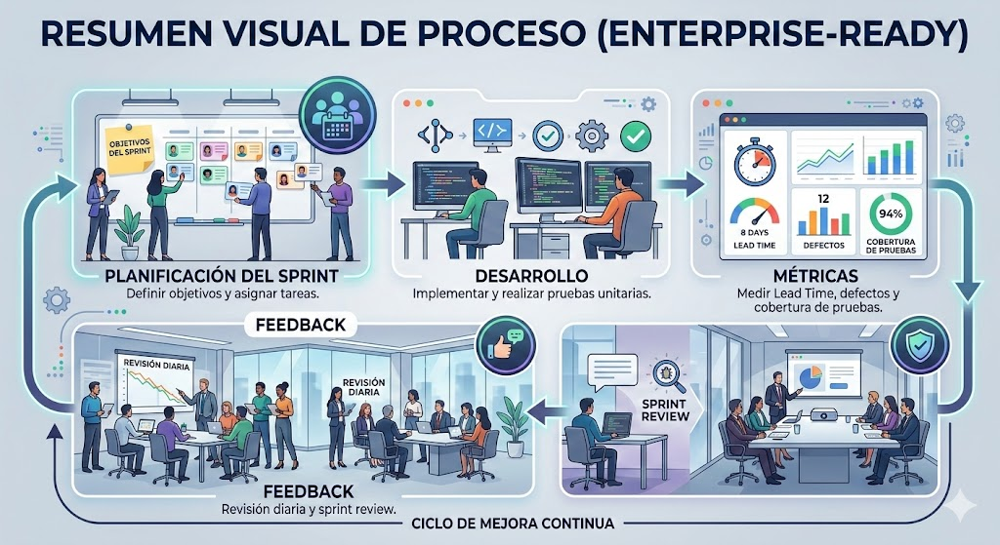
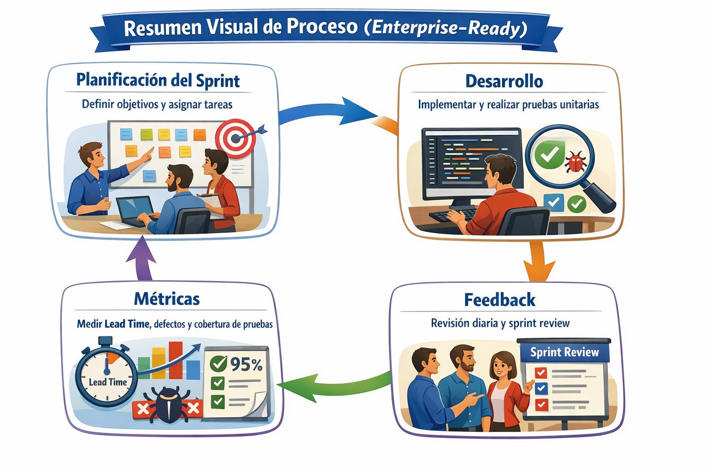
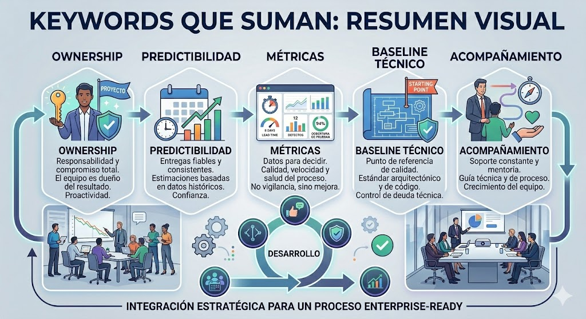
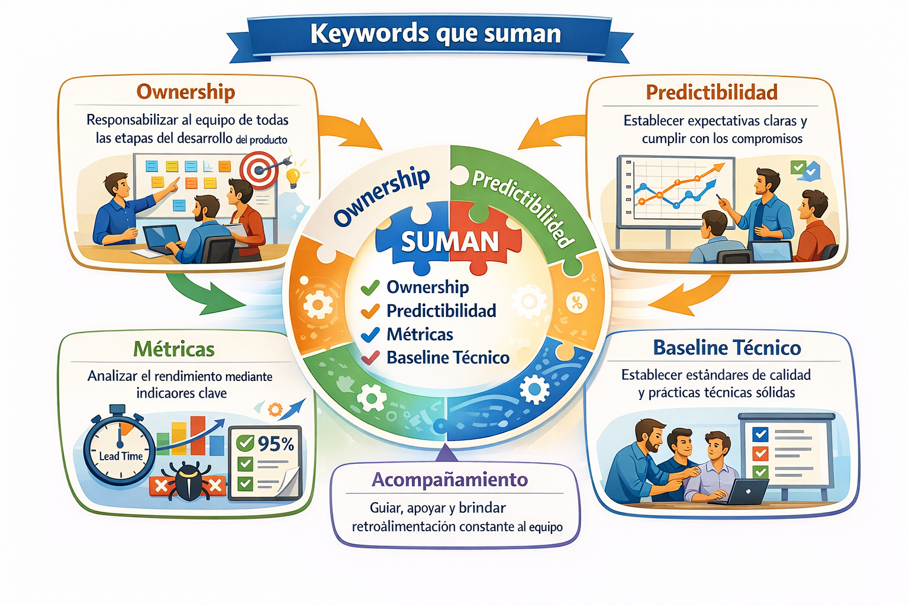
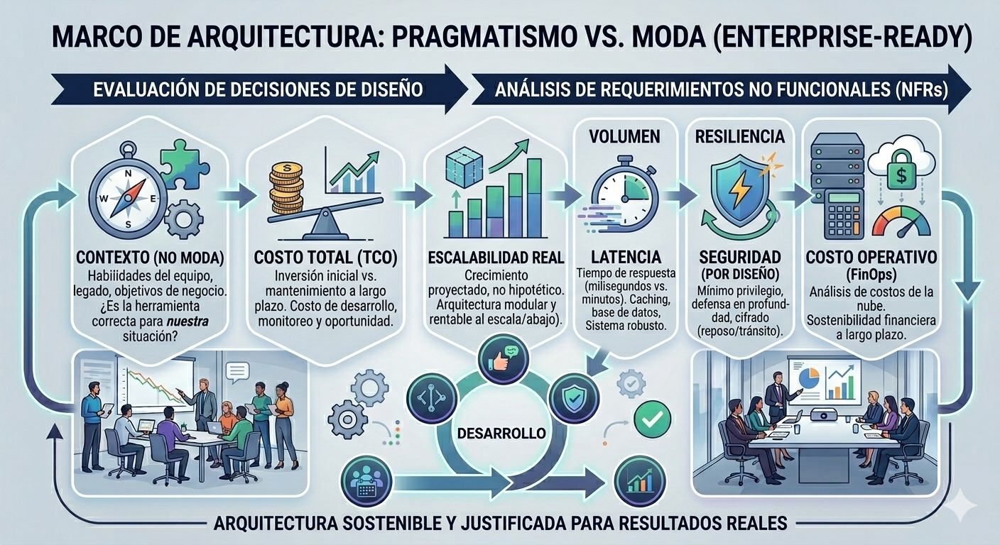

- [Liderazgo técnico y operativo](#liderazgo-técnico-y-operativo)
  - [Trabajo con Objetivos Claros por Sprint (Agile/Scrum)](#trabajo-con-objetivos-claros-por-sprint-agilescrum)
    - [Ejemplo de Sprint](#ejemplo-de-sprint)
  - [Métricas Técnicas (Lead Time, Defectos, Cobertura)](#métricas-técnicas-lead-time-defectos-cobertura)
    - [Lead Time (Tiempo de entrega)](#lead-time-tiempo-de-entrega)
    - [Defectos](#defectos)
    - [Cobertura de Pruebas (Test Coverage)](#cobertura-de-pruebas-test-coverage)
  - [Feedback Continuo](#feedback-continuo)
    - [Revisiones diarias (Daily Standups)](#revisiones-diarias-daily-standups)
    - [Revisión del Sprint (Sprint Review)](#revisión-del-sprint-sprint-review)
    - [Retroalimentación Técnica](#retroalimentación-técnica)
  - [Entregar Valor de Forma Predecible](#entregar-valor-de-forma-predecible)
  - [Resumen Visual de Proceso (Enterprise-Ready)](#resumen-visual-de-proceso-enterprise-ready)
  - [Keywords que suman](#keywords-que-suman)
    - [Ownership (Apropiación)](#ownership-apropiación)
    - [Predictibilidad](#predictibilidad)
    - [Métricas](#métricas)
    - [Baseline Técnico](#baseline-técnico)
    - [Acompañamiento](#acompañamiento)
  - [Arquitectura orientada a resultados](#arquitectura-orientada-a-resultados)
  - [Evaluación Pragmática de Decisiones](#evaluación-pragmática-de-decisiones)
    - [Contexto](#contexto)
    - [Costo](#costo)
    - [Escalabilidad Real](#escalabilidad-real)
  - [Análisis de Requerimientos No Funcionales (NFRs)](#análisis-de-requerimientos-no-funcionales-nfrs)
    - [Volumen](#volumen)
    - [Latencia](#latencia)
    - [Resiliencia](#resiliencia)
    - [Seguridad](#seguridad)
    - [Costo Operativo (FinOps)](#costo-operativo-finops)

## Liderazgo técnico y operativo

### Trabajo con Objetivos Claros por Sprint (Agile/Scrum)

En un entorno **Enterprise-Ready**, es fundamental que el equipo de desarrollo tenga claridad sobre qué se debe lograr en cada sprint. Esto se traduce en tener **objetivos bien definidos** y alineados con los objetivos comerciales de la empresa. Un **Sprint Goal** claro ayuda a enfocar el esfuerzo del equipo y asegurar que las entregas contribuyan de manera directa al valor esperado.

#### Ejemplo de Sprint

Imagina que estás trabajando en una **aplicación de ventas** que necesita integrarse con un **sistema de pagos**. El objetivo de un sprint podría ser: "Integrar el sistema de pagos con la aplicación y asegurar que el proceso de pago funcione correctamente".

Esto implica una serie de **historias de usuario** que deben completarse para alcanzar ese objetivo. Al final del sprint, el equipo debe entregar un incremento funcional del sistema que pueda ser probado y validado.

### Métricas Técnicas (Lead Time, Defectos, Cobertura)

Las métricas son esenciales para mantener el rendimiento predecible y enfocado en la calidad. Aquí te detallo algunas de las métricas clave:

#### Lead Time (Tiempo de entrega)

El **Lead Time** es el tiempo que transcurre desde que una tarea o historia de usuario es **empezada** hasta que se entrega al usuario o cliente. En un ambiente **Enterprise-Ready**, reducir el Lead Time mejora la agilidad del equipo.

**Ejemplo:** Si el equipo tarda 10 días en integrar un sistema de pagos, pero luego se logra reducir a 6 días, se ha optimizado el Lead Time. Las herramientas como **Jira** o **Azure DevOps** pueden ayudarte a medir y visualizar esto.

#### Defectos

El **número de defectos** o errores detectados durante y después del sprint es una métrica crítica. En un entorno empresarial, los defectos deben ser gestionados y corregidos rápidamente para no impactar la producción.

**Ejemplo:** Si en el sprint anterior detectamos 5 defectos en la integración del sistema de pagos, el objetivo es que en el próximo sprint no haya más de 2 defectos. Las herramientas de seguimiento de bugs como **SonarQube** ayudan a identificar posibles defectos durante el ciclo de vida del desarrollo.

#### Cobertura de Pruebas (Test Coverage)

La cobertura de pruebas mide cuán completo es el conjunto de pruebas unitarias y de integración que cubren el código fuente. En un entorno empresarial, tener una **alta cobertura de pruebas** es esencial para asegurar la calidad y evitar defectos en producción.

**Ejemplo:** Si el código tiene una cobertura de pruebas del 80% en una parte crítica, se puede garantizar que el equipo está validando las funcionalidades esenciales, lo que reduce los riesgos. Herramientas como **JaCoCo** o **JUnit** pueden ser usadas para generar informes de cobertura.

### Feedback Continuo

El **feedback continuo** es clave para un equipo ágil y Enterprise-Ready. Los ciclos de retroalimentación son rápidos y frecuentes para corregir problemas en tiempo real y ajustar el rumbo.

#### Revisiones diarias (Daily Standups)

En una revisión diaria, cada miembro del equipo comunica qué hizo el día anterior, qué hará hoy y si tiene algún impedimento. Esto permite detectar problemas rápidamente y ajustar el rumbo.

#### Revisión del Sprint (Sprint Review)

Al final de cada sprint, el equipo realiza una **demo** de las funcionalidades implementadas, obteniendo feedback inmediato de los stakeholders (clientes, líderes de producto, etc.).

#### Retroalimentación Técnica

Además de la retroalimentación funcional, se realiza una **revisión técnica continua** de la calidad del código. Las herramientas de integración continua como **Jenkins** o **GitLab CI/CD** permiten que el código se compile y se pruebe de manera automática, asegurando que cada commit esté listo para ser integrado sin problemas.

### Entregar Valor de Forma Predecible

Para entregar valor de forma predecible, el equipo debe centrarse en las siguientes prácticas:

* **Priorización clara** de tareas que realmente aporten valor a la empresa. Las historias de usuario deben ser evaluadas no solo en términos de esfuerzo, sino también por el valor que aportan al cliente.

* **Revisión continua de la carga de trabajo** para asegurarse de que el equipo no está sobrecargado. Las herramientas de gestión de tareas como **Jira** pueden ayudarte a visualizar cuántos tickets se están completando por sprint.

* **Establecer expectativas claras** con los stakeholders: si un equipo promete entregar una característica en un sprint, debe cumplir con esa promesa o gestionar las expectativas de manera efectiva.

**Ejemplo Práctico:**

Supongamos que tu equipo está trabajando en una nueva funcionalidad para procesar pagos en una tienda en línea. El **Sprint Goal** es integrar la pasarela de pagos de **Stripe**. Durante el sprint:

1. **Objetivo Claro:** "Integrar Stripe para permitir pagos con tarjeta de crédito."
2. **Métricas:** Medir el **Lead Time** para la integración, los **Defectos** que surjan y la **Cobertura de Pruebas** de las nuevas clases relacionadas con pagos.
3. **Feedback Continuo:** Tener reuniones diarias para resolver problemas y una revisión del sprint al final con demostraciones del sistema en producción.

Este enfoque permite **predecir con mayor certeza** cuándo se entregará la funcionalidad y con qué calidad, ayudando al equipo a generar valor continuo y predecible.

### Resumen Visual de Proceso (Enterprise-Ready)

1. **Planificación del Sprint**: Definir objetivos y asignar tareas.
2. **Desarrollo**: Implementar y realizar pruebas unitarias.
3. **Métricas**: Medir Lead Time, defectos y cobertura de pruebas.
4. **Feedback**: Revisión diaria y sprint review.

Este enfoque no solo se basa en “sacar tickets”, sino en **entregar valor continuo**, con el equipo comprometido y alineado con los objetivos del negocio, y usando métricas para evaluar y mejorar constantemente el rendimiento.

### Keywords que suman

#### Ownership (Apropiación)
Se refiere a que el equipo y sus miembros asuman la responsabilidad total de sus tareas y del producto final. Esto fomenta la proactividad, la calidad del trabajo y el compromiso con los resultados, ya que cada uno se siente dueño de su parte del proceso.

#### Predictibilidad
Es la capacidad de entregar valor de manera consistente y fiable a lo largo del tiempo. Al analizar el rendimiento histórico y la velocidad, el equipo puede realizar estimaciones más precisas, lo que genera confianza con los stakeholders y permite una mejor planificación del negocio.

#### Métricas
Son datos cualitativos y cuantitativos que se utilizan para evaluar el progreso, la calidad y la salud del proceso de desarrollo. No se usan para vigilar, sino para tomar decisiones informadas, identificar cuellos de botella y medir el impacto de las mejoras introducidas.

#### Baseline Técnico
Es el punto de referencia que define el estado actual de la calidad y la arquitectura técnica del software. Sirve como un estándar para asegurar que las nuevas funcionalidades se desarrollen sin degradar el código existente y ayuda a gestionar la deuda técnica.

#### Acompañamiento
Se trata del soporte constante, mentoría y guía que se brinda a los equipos para su crecimiento profesional y técnico. Facilita la adopción de buenas prácticas, la resolución de impedimentos y la alineación con los objetivos estratégicos de la organización.

### Arquitectura orientada a resultados

Enfoque basado en el pragmatismo de la ingeniería sobre la "Hype Driven Development" (desarrollo impulsado por la moda). Cada decisión técnica debe estar justificada por las necesidades reales del negocio y las restricciones operativas.

He aquí un desglose de los criterios clave:

### Evaluación Pragmática de Decisiones
#### Contexto
Ninguna tecnología es una "bala de plata". Analizo el contexto específico del proyecto: las habilidades del equipo actual, el estado de la base de código existente y los objetivos de negocio a corto y largo plazo antes de proponer un cambio arquitectónico.

#### Costo 
Evalúo el Costo Total de Propiedad (TCO). No solo el costo de las licencias o el cómputo en la nube, sino el costo de desarrollo, mantenimiento, monitoreo y el costo de oportunidad si la tecnología resulta ser demasiado compleja.

#### Escalabilidad Real
Diseño para el crecimiento proyectado, no para un crecimiento hipotético de "escala web" si no es necesario. El objetivo es una arquitectura que pueda escalar de forma rentable (hacia arriba o hacia abajo) cuando sea necesario, sin introducir una complejidad innecesaria prematuramente.

### Análisis de Requerimientos No Funcionales (NFRs)
#### Volumen
Determino cómo manejará el sistema la cantidad de datos que necesita procesar, almacenar e ingerir, tanto en estado estacionario como durante los picos de carga.

#### Latencia
Establezco objetivos claros para el tiempo de respuesta. ¿Es un sistema en tiempo real que requiere milisegundos, o un procesamiento por lotes donde unos minutos son aceptables? Esto dicta decisiones clave sobre bases de datos, almacenamiento en caché y protocolos de comunicación.

#### Resiliencia
Diseño para el fallo. Implemento estrategias como reintentos, disyuntores (circuit breakers) y degradación elegante de la funcionalidad para asegurar que el sistema siga operativo incluso cuando componentes individuales fallen.

#### Seguridad
La seguridad no es una capa externa, sino parte integral del diseño. Aplico principios de "mínimo privilegio", defensa en profundidad y cifrado de datos en reposo y en tránsito.

#### Costo Operativo (FinOps)
Cada decisión de arquitectura tiene un reflejo en la factura de la nube. Analizo el costo de operación continuo para garantizar la sostenibilidad financiera de la solución a largo plazo.

