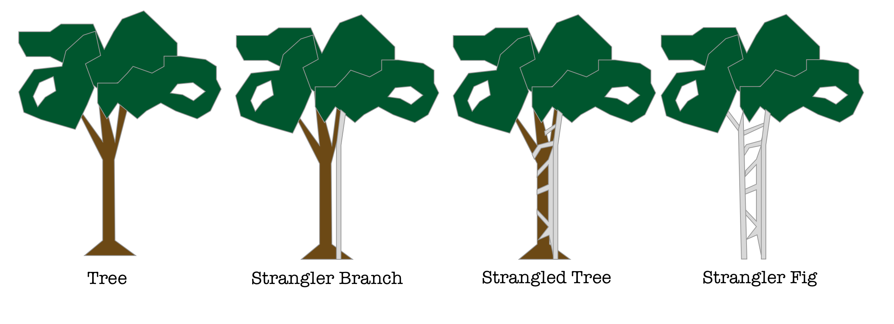
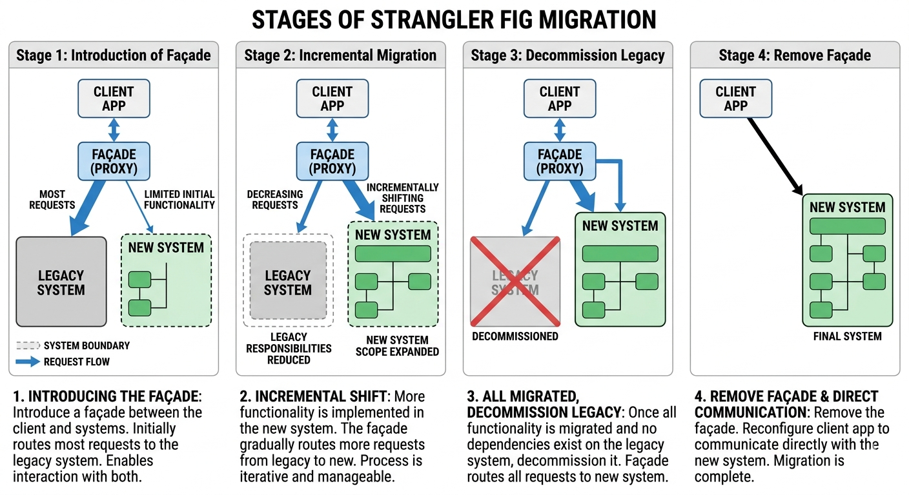

- [Patterns](#patterns)
  - [Strangler Fig Pattern](#strangler-fig-pattern)

# Patterns
## Strangler Fig Pattern
* The Strangler Fig Pattern is a software design and migration pattern used to gradually replace or modernize a legacy system without completely rewriting it from scratch.

* The name comes from how a strangler fig tree grows around a host tree — it slowly replaces the old tree until only the new structure remains. Similarly, in software, you “wrap” the legacy system with new components and gradually move functionality from the old system to the new one.



**Incremental process**

1. The Strangler Fig pattern begins by introducing a façade (proxy) between the client app, the legacy system, and the new system. The façade acts as an intermediary. It allows the client app to interact with the legacy system and the new system. Initially, the façade routes most requests to the legacy system.

2. As the migration progresses, the façade incrementally shifts requests from the legacy system to the new system. With each iteration, you implement more pieces of functionality in the new system. This incremental approach gradually reduces the legacy system's responsibilities and expands the scope of the new system. The process is iterative. It allows the team to address complexities and dependencies in manageable stages. These stages help the system remain stable and functional.

3. After you migrate all of the functionality and there are no dependencies on the legacy system, you can decommission the legacy system. The façade routes all requests exclusively to the new system.

4. You remove the façade and reconfigure the client app to communicate directly with the new system. This step marks the completion of the migration.



**Simple Example (in Python)**
* Suppose you have a legacy system for handling user data, and you’re building a new microservice to replace it.

```python
# --- Legacy System ---
class LegacyUserService:
    def get_user(self, user_id):
        print("Fetching user from Legacy System...")
        return {"id": user_id, "name": "Alice (Legacy)"}

# --- New System ---
class NewUserService:
    def get_user(self, user_id):
        print("Fetching user from New System...")
        return {"id": user_id, "name": "Alice (New)"}

# --- Strangler Facade ---
class UserServiceFacade:
    def __init__(self):
        self.legacy_service = LegacyUserService()
        self.new_service = NewUserService()

    def get_user(self, user_id):
        # Gradual migration rule: use new service for user_id > 1000
        if user_id > 1000:
            return self.new_service.get_user(user_id)
        else:
            return self.legacy_service.get_user(user_id)

# --- Client Code ---
facade = UserServiceFacade()

print(facade.get_user(500))    # Uses legacy system
print(facade.get_user(1500))   # Uses new system
```
