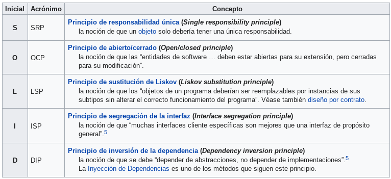
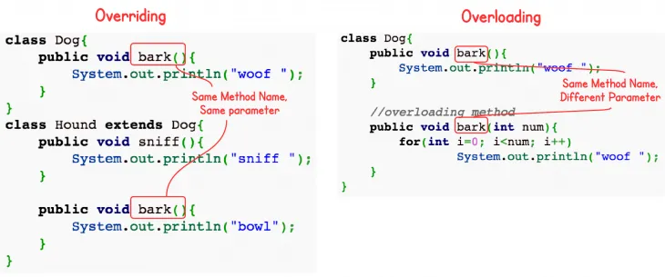

# Indice
1. [Design Patterns](#designPatterns)
2. [Object Oriented Programming](#oop)
	1. [SOLID Principle](#solid)
	2. [Immutable Class](#immutableClass)
	3. [Overriding vs Overloading](#overridingOverloading)
3. [Java](#java)
	1. [Difference between final, finally and finalize](#finalFinallyFinalize)
	2. [ArrayList vs LinkedList](#arrayListLinkedList)
	
4. [Spring](#spring)
	1. [Bean scope](#beanScope)
	2. [Singleton](#singleton)
	3. [Prototype](#prototype)	
	
n. [Thread](#thread)


#  <a name="designPatterns">Design Patterns</a>
## Decorator Pattern
## Adapter Pattern

# <a name="oop">Object Oriented Programming</a>
## <a name='solid'>SOLID Principle</a>


## <a name='immutableClass'>Immutable Class</a>
* Concept: The instance cannot change the value after create an object.

* Setters: Mutators, getters: accesors.

* The class is final so we cannot create a subclass.

* There is no setter methods.

* Final class and final data members.
	
```java
public final class Employee{  
	final String pancardNumber;  

	public Employee(String pancardNumber){
		this.pancardNumber=pancardNumber;  
	}

	public String getPancardNumber(){  
		return pancardNumber;  
	}  
}
```

* In Java, all primitive wrapper classes (Integer, Byte, Long, Float, Double, Character, Boolean and Short) and String are immutable in nature.

## <a name='overridingOverloading'>Overriding vs Overloading</a>



* **Overriding** same method name and parameters (i.e., method signature), between parent class and child classes (provide a specific implementation of its parent class' method.

* **Overloading** occurs when two or more methods in one class have the same method name but different parameters.

* Overriding and Overloading implement polymorphism in our java programs. Polymorphism is one of the OOPS Concepts.

# <a name='java'>Java</a>
## <a name='finalFinallyFinalize'>Difference between final, finally and finalize</a>

| final	| finally | finalize |
| --- | --- | --- |
| Final is used to apply restrictions on class, method and variable. Final class can't be inherited, final method can't be overridden and final variable value can't be changed. | Finally is used to place important code, it will be executed whether exception is handled or not. | Finalize is used to perform clean up processing just before object is garbage collected. |
| Final is a keyword. | Finally is a block. | Finalize is a method. |

Java final example

```java
class FinalExample{  
	public static void main(String[] args){  
		final int x=100;  
		x=200;//Compile Time Error  
	}
}  
```

Java finally example
```java
class FinallyExample{  
	public static void main(String[] args){  
	   try{  
	      int x=300;  
	   }catch(Exception e){
	      System.out.println(e);
       }  
	   finally{
		   System.out.println("finally block is executed");
      }  
	}
}
```
Java finalize example
```java
class FinalizeExample{  
    public void finalize(){
        System.out.println("finalize called");
    }  
    public static void main(String[] args){  
        FinalizeExample f1=new FinalizeExample();  
        FinalizeExample f2=new FinalizeExample();  
        f1=null;  
        f2=null;  
        System.gc();  
    }
}  
```

## <a name='arrayListLinkedList'>ArrayList vs LinkedList</a>
| Key | ArrayList | LinkedList |
| --- | --- | --- |
| Internal Implementation | ArrayList internally uses a dynamic array to store its elements. |	LinkedList uses Doubly Linked List to store its elements. |
| Manipulation | ArrayList is slow as array manipulation is slower. | LinkedList is faster being node based as not much bit shifting required. |
| Implementation | ArrayList implements only List. | LinkedList implements List as well as Queue. It can acts as a queue as well. |
| Access | ArrayList is faster in storing and accessing data. | LinkedList is faster in manipulation of data. |

# <a name="spring">Spring</a>

## <a name="beanScope">Bean scope</a>

The scope of a bean defines the life cycle and visibility of that bean in the contexts we use it. The latest version of the Spring framework defines 6 types of scopes:

| Scope | Description |
| --- | --- |
| Singleton | The container creates a single instance of that bean; all requests for that bean name will return the same object, which is cached. Any modifications to the object will be reflected in all references to the bean. This scope is the default value if no other scope is specified. |
| Prototype | A bean with the prototype scope will return a different instance every time it is requested from the container. It is defined by setting the value prototype to the @Scope annotation. |
| Request | The Request scope creates a bean instance for a single HTTP Request. | 
| Session | The Session scope creates a bean instance for an HTTP Session. |
| Application | The Application scope creates the bean instance for the lifecycle of a ServletContext. |
| Websocket | The Websocket scope creates the bean instance for a particular WebSocket session. |

<br />
_The last four scopes mentioned, request, session, application and websocket, are only available in a web-aware application._

## <a name="singleton">Singleton</a>
```java
package ec.carper.javacore.scope;

import lombok.AllArgsConstructor;
import lombok.Getter;
import lombok.NoArgsConstructor;
import lombok.Setter;
import lombok.ToString;

@NoArgsConstructor
@AllArgsConstructor
@Getter @Setter @ToString
public class Person {
	private String name;

}
```
Afterwards, we define the bean with the singleton scope by using the @Scope annotation:

```java
@Bean
// @Scope(value = ConfigurableBeanFactory.SCOPE_SINGLETON)
@Scope("singleton")
public Person personSingleton() {
    return new Person();
}
```
Now we can proceed to write a test that shows that two objects referring to the same bean will have the same values, even if only one of them changes their state, as they are both referencing the same bean instance:

```java
private static final String NOMBRE = "CARLOS JULIO";
private static final String NOMBRE2 = "JOSE ANTONIO";

@Test
public void singletonTest() {
	final ApplicationContext applicationContext = new ClassPathXmlApplicationContext("scopes.xml");
	final Person personA = (Person) applicationContext.getBean("personSingleton");
	final Person personB = (Person) applicationContext.getBean("personSingleton");

	personA.setName(NOMBRE);
	assertEquals(NOMBRE, personB.getName());

	System.out.println(personA.getName());
	System.out.println(personB.getName());

	((AbstractApplicationContext) applicationContext).close();
}
```

The scopes.xml file in this example should contain the xml definitions of the beans used:

```xml
<?xml version="1.0" encoding="UTF-8"?>
<beans xmlns="http://www.springframework.org/schema/beans"
    xmlns:xsi="http://www.w3.org/2001/XMLSchema-instance"
    xsi:schemaLocation="http://www.springframework.org/schema/beans 
    http://www.springframework.org/schema/beans/spring-beans.xsd">

    <bean id="personSingleton" class="ec.carper.javacore.scope.Person" scope="singleton"/>
</beans>
```

## <a name="prototype">Prototype</a>
```java
@Bean
// @Scope(value = ConfigurableBeanFactory.SCOPE_PROTOTYPE)
@Scope("prototype")
public Person personPrototype() {
    return new Person();
}
```
We will now write a similar test as before that shows two objects requesting the same bean name with the prototype scope. They will have different states as they are no longer referring to the same bean instance:

```java
@Test
public void prototypeTest() {
	ApplicationContext applicationContext = new ClassPathXmlApplicationContext("scopes.xml");
	Person personPrototypeA = (Person) applicationContext.getBean("personPrototype");
	Person personPrototypeB = (Person) applicationContext.getBean("personPrototype");

	personPrototypeA.setName(NOMBRE);
	personPrototypeB.setName(NOMBRE2);

	System.out.println(personPrototypeA.getName());
	System.out.println(personPrototypeB.getName());

	assertEquals(NOMBRE, personPrototypeA.getName());
	assertEquals(NOMBRE2, personPrototypeB.getName());

	((AbstractApplicationContext) applicationContext).close();
}
```
The scopes.xml file is similar to the one presented in the previous section while adding the xml definition for the bean with the prototype scope:

```xml
    <bean id="personPrototype" class="ec.carper.javacore.scope.Person" scope="prototype"/>
```
<!-- https://www.baeldung.com/spring-bean-scopes -->

# Collector

# Streams
<!-- https://www.tutorialspoint.com/java8/java8_streams.htm -->

# Corder

# <a name="thread">Thread</a>
	stop, run, finalize
	thread-safety, caching and collections.

# Testing, Mock, Stub

* JMS, Kafka:

# Topics, Lambdas, Colas

# CI/CD, contenedores, 

# Service Discovery, Circuit Breaker

# kubernetes, AWS, Azure

# Ejemplos: 
* Readme.md [Ejemplo](https://gist.github.com/Villanuevand/6386899f70346d4580c723232524d35a)

* Tables [Ejemplo](https://docs.github.com/en/github/writing-on-github/working-with-advanced-formatting/organizing-information-with-tables)
